# Bersama Agentic Ecosystem 🌐
> **bersama** *(pronounced: "ber-SAH-mah", /bər.sa.ma/)*
> 
> *collaborative, joint, together.*

**Bersama** is a unified, highly modular ecosystem of autonomous services designed to manage the entire Software Development Lifecycle (SDLC). By decomposing the development pipeline into specialized, loosely coupled layers—each named in thematic Indonesian/Malay—Bersama showcases how modern enterprise agentic infrastructure operates: secure, cost-optimized, highly observable, and robust.

---

## 🗺️ The Ecosystem Architecture

```mermaid
graph TD
    classDef main fill:#1a1b26,stroke:#7aa2f7,stroke-width:2px;
    classDef support fill:#1f2335,stroke:#bb9af7,stroke-width:1px;

    PRD["📄 Product PRD / Specification"] -->|Decompose Requirements| Rencana["📋 Rencana (Planner)"]
    Rencana -->|Generate Dependency Graph| GH["octocat GitHub Issues & PRD state"]
    
    GH -->|Concurrently Claim Issues| Rangkai["🔗 Rangkai (Orchestrator)"]
    
    subgraph ExecutionSandbox ["Secure Isolation"]
        Rangkai -->|Provision Ephemeral VM| Benteng["🛡️ Benteng (Sandbox)"]
        Benteng -->|Context Injection| Pustaka["📚 Pustaka (Semantic Memory)"]
        Benteng -->|Run Agent Harness| AR["🤖 Active Agent Run"]
    end
    
    AR -->|Emit Trajectories| Pantau["👁️ Pantau (Observability)"]
    AR -->|Yield Code Modifications| Saringan["⚖️ Saringan (Judge/Filter)"]
    
    subgraph Validation ["Headless QA Gate"]
        Saringan -->|Tier 1-4 Verification| Gate{"Pass Gate"}
    end
    
    Gate -->|PASS: Exit 0| Integrate["🚀 Merge & Integrate PR"]
    Gate -->|FAIL: Exit 1| GH
    
    Integrate -->|Index new code patterns| Pustaka
    
    class Rencana,Rangkai,Saringan main;
    class Benteng,Pantau,Pustaka support;
    
    style ExecutionSandbox fill:#16161e,stroke:#414868,stroke-width:1px;
    style Validation fill:#16161e,stroke:#414868,stroke-width:1px;
```

---

## 🏛️ The Six Pillars of Bersama

| Layer Name | Role | Responsibilities | Status |
| :--- | :--- | :--- | :--- |
| **Rangkai** 🔗 | *The Orchestrator* | State machine, concurrency queues, branch/worktree generation, git operation locks, CLI executors. | **Active (Core)** |
| **Saringan** ⚖️ | *The Judge / Filter* | Four-tier quality checks (static analysis, unit tests, local LLM semantic judgment, security scans). | **Planned (Spec-ready)** |
| **Rencana** 📋 | *The Planner* | PRD parsing, codebase impact analysis, GitHub Issue schema creation, dependency tree modeling. | *Concept* |
| **Benteng** 🛡️ | *The Sandbox* | Ephemeral Docker/gVisor runtime containment, host file isolation, network egress throttling. | *Concept* |
| **Pantau** 👁️ | *The Observer* | Step-by-step LLM trace logging, system resource tracing, OpenTelemetry exports, time-travel trajectory replay. | *Concept* |
| **Pustaka** 📚 | *The Semantic Memory* | Code snippet embeddings, retrieval-augmented context injection, database of historical successful changes. | *Concept* |

---

## 📂 Detailed Layer Blueprints

### 1. Rencana 📋 (The Planner & Spec Decomposer)
*   **Purpose:** Bridge the gap between high-level human requirements and atomic coding tasks.
*   **Mechanism:** Ingests a new markdown PRD. It runs semantic searches across the repository to locate affected files, plans the architectural implementation changes, and outputs a series of granular GitHub Issues labeled `ready-for-agent`.
*   **Integrates with Rangkai:** Automatically formats issue bodies with the parent metadata, blocked-by configurations, and acceptance criteria required for autonomous Rangkai executions.

### 2. Rangkai 🔗 (The Core Orchestrator)
*   **Purpose:** Safely manage continuous execution of multiple coding agent harnesses.
*   **Mechanism:** Implements file-based locking mechanisms to handle concurrent repository mutations. It reconciles local state with remote GitHub issue boards, clones branches, provisions worktrees, runs the developer's favorite harness (e.g., Codex), and integrates accepted commits back into the main branch.
*   **Integrates with Saringan:** Right before checking in changes for pull request integration, Rangkai halts the pipeline and hands the worktree path off to Saringan for validation.

### 3. Benteng 🛡️ (The Isolation Sandbox)
*   **Purpose:** Protect host development machines from untrusted package code execution or malicious command scripts.
*   **Mechanism:** Rather than running coding harnesses in standard worktrees on the bare metal, Benteng spins up a fast, lightweight container (using gVisor or Docker) mapped solely to the isolated worktree directory.
*   **Integrates with Rangkai:** Seamlessly wraps the agent harness command, ensuring all compilation steps, installations, and executions are strictly locked inside the sandbox.

### 4. Saringan ⚖️ (The Headless QA Judge)
*   **Purpose:** Stop hallucinations, half-finished `TODO` blocks, lint failures, and security defects from corrupting integration branches.
*   **Mechanism:** Executes a multi-stage validation suite:
    1.  *Tier 1:* Strict static formatting and type check (`ruff`/`eslint`/`tsc`).
    2.  *Tier 2:* Automated sandbox execution of test scripts with coverage verification.
    3.  *Tier 3:* Structured **LLM-as-a-Judge** checking semantic alignment of git diffs against the issue prompt using a cost-efficient local model (e.g., Qwen 2.5 served via Ollama).
    4.  *Tier 4:* Secret scanning and computational complexity bottlenecks verification.
*   **Integrates with Rangkai:** Exposes REST endpoints (`/api/verify`, `/api/metrics`) allowing Rangkai's core engine to execute validations and Rangkai's Control Center to render detailed scorecards.

### 5. Pantau 👁️ (Observability & APM Telemetry)
*   **Purpose:** Eliminate the "black box" problem of autonomous agent executions.
*   **Mechanism:** Captures and aggregates telemetry traces. Whenever an agent requests a completion, edits a file, or runs a terminal command, Pantau logs the event, time, cost, and output.
*   **Integrates with Rangkai & Saringan:** Provides developers with a dashboard interface showing the exact sequence of events, letting them inspect why a run was rejected by Saringan.

### 6. Pustaka 📚 (Semantic Memory & Retrieval)
*   **Purpose:** Optimize the agent's context window by serving highly specific code knowledge.
*   **Mechanism:** Parses and indexes the entire codebase into a vector database. During execution, it automatically performs local search queries to retrieve relevant code snippets, avoiding raw codebase bloating in context prompts.
*   **Integrates with Rangkai:** Acts as a context-provisioning middleware that prepares target files before the agent harness executes.

---

> [!IMPORTANT]
> **Why this Ecosystem is a Portfolio Showstopper:**
> While most developers build simple single-prompt wrapper scripts, the **Bersama Ecosystem** models a production-grade, enterprise-scale software engineering platform. It highlights complete system awareness: combining **systems orchestration** (Rangkai), **virtualized security** (Benteng), **structured AI validation** (Saringan), and **APM engineering** (Pantau) into a cohesive, beautifully designed Malay/Indonesian-themed architecture.
