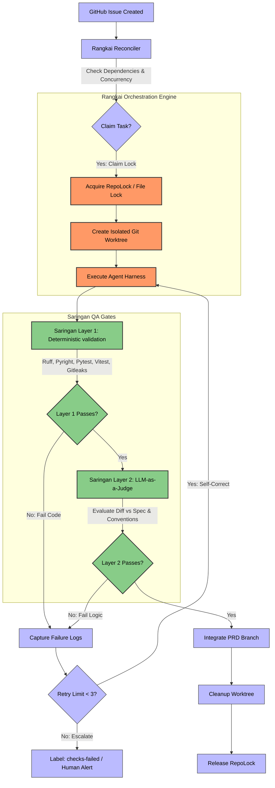

# Bersama: Autonomous Agentic SDLC Ecosystem

[](https://www.python.org/)
[](#1-rangkai-orchestration-engine)
[](#2-saringan-automated-qa--judge-gate)
[](LICENSE.md)

**Bersama** *(Malay for "Together")* is an autonomous, headless agentic SDLC ecosystem. It enables swarms of coding agents to plan, implement, and self-correct software changes directly against GitHub Issues. Rather than acting as a simple chatbot wrapper, Bersama operates as a rigorous systems-level engine that manages git workspaces, serializes repository state, streams agent telemetry, and audits code quality before merging.

The ecosystem is built around two core architectural layers:
1.  **Rangkai (Orchestrator):** A state-machine engine that claims issues, spins up isolated worktrees, executes agent harnesses, and manages task integration.
2.  **Saringan (QA & Judge Gate):** A multi-stage quality gate combining deterministic rule-based checks (lints, test suites, builds) with a decoupled **LLM-as-a-Judge** verification pipeline (utilizing Decision Trees/DAGs and QAG checklists).

---

## System Architecture & Workflow

The diagram below outlines the lifecycle of an issue claim, agent implementation, validation, and integration under the Bersama ecosystem:



---

## Core Modules

### 1. Rangkai (Orchestration Engine)
*Pronounced: "rUNG-kye" (/raŋ.kaɪ/), meaning to connect, sequence, or assemble separate parts.*

Rangkai coordinates autonomous task execution using a state-graph pattern. Key engineering mechanics include:
*   **Two-Phase Transactional Claims:** Prevents race conditions by locking task ownership via GitHub metadata and repository locks before provisioning directories.
*   **Advisory File Locking (`RepoLock`):** Serializes critical Git mutations (branch forks, integrations, commits) across parallel runner processes to prevent head corruption.
*   **Process-Group Isolation:** Spawns and manages agent processes inside isolated sub-process groups, ensuring cleanup of orphan background processes if an agent fails or timeouts.
*   **Zero-Database State Reconciler:** Decouples execution state entirely into VCS (Git metadata, branches, worktrees) and GitHub Issue metadata, bypassing database synchronizations.

### 2. Saringan (Automated QA & Judge Gate)
*Pronounced: "sah-rING-an", meaning filter or sieve.*

Saringan acts as a headless code auditor that evaluates the code changes generated by active agent runs. It executes as a two-layer validation gate:
*   **Layer 1: Deterministic Gate:** Local static checks executed inside the agent's worktree. Runs Gitleaks (secrets scan), Ruff (linter), Pyright (types check), eslint, unit testing runners (pytest / vitest), pnpm build checks, and pip-audit. If any check fails, execution pauses, logs are collected, and it feeds back into the agent's retry loop.
*   **Layer 2: LLM-as-a-Judge (Decoupled):** A contextual review engine that runs after Layer 1 passes. It evaluates git diffs against the issue specification and `CONVENTIONS.md` using:
    *   **Deep Acyclic Graphs (DAG):** Decomposes code evaluation into sequential decision-tree node checks (e.g. Scope verification $\rightarrow$ Debug statements check $\rightarrow$ Acceptance checklist), failing early to conserve API tokens.
    *   **QAG-Score Checklists:** Decomposes the issue's requirements into binary "Yes/No/IDK" questions to mathematically grade implementation coverage, completely bypassing subjective scalar numeric grading (e.g. "rate code 1 to 10").
    *   **Bias Mitigation:** Strict checklist parsing eliminates cognitive LLM biases (length/verbosity biases and self-enhancement biases).

---

##  Getting Started

### Prerequisites
- `git`
- GitHub CLI `gh`, authenticated for the target repository.
- The Agent Harness command configured in `bersama.yaml`, such as `codex`.

### Installation
Clone the repository and install in editable mode with development dependencies:

Using `uv` (recommended):
```bash
uv pip install -e ".[dev]"
```

Or using standard `pip`:
```bash
python -m pip install -e ".[dev]"
```

### Configuration
Bersama reads `bersama.yaml` from the current directory by default. 

```yaml
harnesses:
  codex-headless:
    command: codex
    args_template:
      - exec
      - "--dangerously-bypass-approvals-and-sandbox"
      - "$tdd solve issue #{issue_number} on github and commit once execution is complete"

repos:
  bersama:
    repo_path: /home/me/src/bersama
    main_branch: main
    worktree_root: /home/me/src/bersama/worktrees
    global_concurrency: 2
    per_prd_concurrency: 1
    default_harness: codex-headless
```

---

## Running the Dashboard

The dashboard provides a visual cockpit showing repositories, active issues, execution logs, and agent harnesses.

### Option A: Pre-built Production UI (Single Port)
Compiles React assets and serves both frontend and FastAPI endpoints on a single port (8000 by default).

1. **Build the frontend assets:**
   ```bash
   cd dashboard
   npm install
   npm run build
   cd ..
   ```
2. **Start the API server:**
   ```bash
   bersama dashboard --config bersama.yaml --host 127.0.0.1 --port 8000
   ```
3. **Open:** [http://127.0.0.1:8000](http://127.0.0.1:8000)

### Option B: Hot-Reloading Development (Two Ports)
Runs backend API and Vite hot-reloading dev server concurrently for code modifications.

1. **Start backend API (Port 8000):**
   ```bash
   bersama dashboard --config bersama.yaml --host 127.0.0.1 --port 8000
   ```
2. **Start Vite server (Port 5173):**
   ```bash
   cd dashboard
   npm run dev
   ```
3. **Open:** [http://localhost:5173](http://localhost:5173) (Routes requests to API on port 8000).

---

##  Observability & Telemetry

Rangkai proxies and displays Execution Telemetry (token usage, latency, and costs) using the external `pi-agent-observability` service via a zero-network telemetry pattern reading directly from SQLite files.

To run observability locally:
1.  **Navigate to observability repository:**
    ```bash
    cd /programming/pi-agent-observability/apps/observability
    ```
2.  **Start Bun server:**
    ```bash
    OBS_AUTH_TOKEN="devtoken" OBS_PORT="43190" bun server.ts
    ```
3.  **View live telemetry stream:** Open [http://127.0.0.1:43190/?token=devtoken](http://127.0.0.1:43190/?token=devtoken)

---

##  CLI Orchestrator Operations

Run one orchestration cycle:
```bash
bersama run bersama --config bersama.yaml
```

Run continuously until all claimable Ready Issues are complete:
```bash
bersama run bersama --config bersama.yaml --continuous
```

### Manual Operations (Granular Control)
*   **Reconcile issue state:** `bersama reconcile bersama`
*   **Prepare PRD Issue branch:** `bersama prepare-prd bersama {issue_number}`
*   **Claim an issue & build worktree:** `bersama claim-issue bersama {issue_number} --agent-run-id {run_id}`
*   **Run harness against claimed issue:** `bersama execute-run bersama {issue_number}`
*   **Integrate successful changes:** `bersama integrate-run bersama {issue_number}`

---

##  License

Licensed under the Apache License, Version 2.0. See [LICENSE.md](LICENSE.md) for details.
