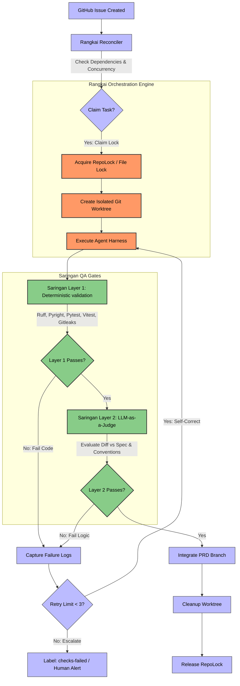

# Rangkai: Autonomous Agentic Orchestrator (Bersama Ecosystem)

[](https://www.python.org/)
[](#1-rangkai-orchestration-engine)
[](LICENSE.md)

**Rangkai** *(pronounced: "rUNG-kye", /raŋ.kaɪ/, meaning to connect, sequence, or assemble separate parts)* is the core state-machine orchestration engine of the **Bersama** SDLC ecosystem. It coordinates autonomous agent tasks by claiming issues, spinning up isolated git worktrees, executing agent harnesses, and safely integrating code changes.

> [!NOTE]
> This repository houses the standalone **Rangkai** orchestrator and its dashboard cockpit. For details on the broader ecosystem roadmap (including the planned judge, memory, and sandbox layers), see [ECOSYSTEM.md](file:///home/ungku/programming/rangkai/ECOSYSTEM.md).

The ecosystem is built around two core architectural layers:
1.  **Rangkai (Orchestrator):** A state-machine engine that claims issues, spins up isolated worktrees, executes agent harnesses, and manages task integration (contained in this repository).
2.  **Saringan (QA & Judge Gate):** A decoupled, multi-stage quality gate combining deterministic checks with an LLM-as-a-Judge verification pipeline (designed to live in an external repository).


---

## System Architecture & Workflow

The diagram below outlines the lifecycle of an issue claim, agent implementation, validation, and integration under the Bersama ecosystem:



---

## Core Modules

### 1. Rangkai (Orchestration Engine)
*Pronounced: "rUNG-kye" (/raŋ.kaɪ/), meaning to connect, sequence, or assemble separate parts.*

Rangkai coordinates autonomous task execution using a state-graph pattern. Key engineering mechanics include:
*   **Two-Phase Transactional Claims:** Prevents race conditions by locking task ownership via GitHub metadata and repository locks before provisioning directories.
*   **Advisory File Locking (`RepoLock`):** Serializes critical Git mutations (branch forks, integrations, commits) across parallel runner processes to prevent head corruption.
*   **Process-Group Isolation:** Spawns and manages agent processes inside isolated sub-process groups, ensuring cleanup of orphan background processes if an agent fails or timeouts.
*   **Zero-Database State Reconciler:** Decouples execution state entirely into VCS (Git metadata, branches, worktrees) and GitHub Issue metadata, bypassing database synchronizations.

### 2. Saringan (Automated QA & Judge Gate)
*Pronounced: "sah-rING-an", meaning filter or sieve.*

Saringan acts as a headless code auditor that evaluates the code changes generated by active agent runs. It executes as a two-layer validation gate:
*   **Layer 1: Deterministic Gate:** Local static checks executed inside the agent's worktree. Runs Gitleaks (secrets scan), Ruff (linter), Pyright (types check), eslint, unit testing runners (pytest / vitest), pnpm build checks, and pip-audit. If any check fails, execution pauses, logs are collected, and it feeds back into the agent's retry loop.
*   **Layer 2: LLM-as-a-Judge (Decoupled):** A contextual review engine that runs after Layer 1 passes. It evaluates git diffs against the issue specification and `CONVENTIONS.md` using:
    *   **Deep Acyclic Graphs (DAG):** Decomposes code evaluation into sequential decision-tree node checks (e.g. Scope verification $\rightarrow$ Debug statements check $\rightarrow$ Acceptance checklist), failing early to conserve API tokens.
    *   **QAG-Score Checklists:** Decomposes the issue's requirements into binary "Yes/No/IDK" questions to mathematically grade implementation coverage, completely bypassing subjective scalar numeric grading (e.g. "rate code 1 to 10").
    *   **Bias Mitigation:** Strict checklist parsing eliminates cognitive LLM biases (length/verbosity biases and self-enhancement biases).

---

##  Getting Started

### Prerequisites
- `git`
- GitHub CLI `gh`, authenticated for the target repository.
- The Agent Harness command configured in `rangkai.yaml`, such as `codex`.

### Installation
Clone the repository and install in editable mode with development dependencies:

Using `uv` (recommended):
```bash
uv pip install -e ".[dev]"
```

Or using standard `pip`:
```bash
python -m pip install -e ".[dev]"
```

### Configuration
Rangkai reads `rangkai.yaml` from the current directory by default. 

```yaml
harnesses:
  codex-headless:
    command: codex
    args_template:
      - exec
      - "--dangerously-bypass-approvals-and-sandbox"
      - "$tdd solve issue #{issue_number} on github and commit once execution is complete"

repos:
  rangkai:
    repo_path: /home/me/src/rangkai
    main_branch: main
    worktree_root: /home/me/src/rangkai/worktrees
    global_concurrency: 2
    per_prd_concurrency: 1
    default_harness: codex-headless
```

### Quality Gate (Saringan Layer 1)

Each repository can configure an optional Quality Gate that runs after a successful Agent Run and before an Integration Pull Request is created. The gate invokes [Saringan](https://github.com/ungkuamer/saringan) — or any compatible validation CLI — as an external command and parses a machine-readable Validation Result JSON from stdout.

**Default behavior:** quality gates are disabled. Repos without a `quality_gate` configuration (or with `enabled: false`) skip the gate and proceed directly to Integration Pull Request creation.

#### Configuration Fields

| Field | Type | Required | Default | Description |
| :--- | :--- | :--- | :--- | :--- |
| `enabled` | boolean | no | `false` | When `false`, the gate is skipped. When `true`, `command` is required. |
| `command` | string | when enabled | — | Path to the Saringan CLI or wrapper (e.g. `saringan`, `./bin/validate.sh`, `/path/to/sibling/saringan/cli.py`). |
| `args_template` | list of strings | no | `[]` | Positional arguments appended after `command`. Supports template variables (see below). |
| `timeout_seconds` | integer | no | `300` | Maximum wall-clock seconds for the command. Timed-out gates are treated as failures. |

#### Template Variables

The following variables are available in `args_template` strings and are rendered at invocation time:

| Variable | Value |
| :--- | :--- |
| `{repo_name}` | Repository name from config |
| `{repo_path}` | Absolute path to the repository root |
| `{worktree_root}` | Worktree root directory |
| `{worktree_path}` | Absolute path to the isolated worktree for this issue |
| `{issue_number}` | GitHub issue number of the Implementation Issue |
| `{parent_prd_number}` | GitHub issue number of the parent PRD Issue |
| `{prd_branch}` | PRD branch name (e.g. `prd/149-some-feature`) |
| `{implementation_branch}` | Implementation branch name (e.g. `impl/149/153-docs`) |

#### Example: Installed Saringan CLI

```yaml
repos:
  rangkai:
    repo_path: /home/me/src/rangkai
    main_branch: main
    worktree_root: /home/me/src/rangkai/worktrees
    global_concurrency: 2
    per_prd_concurrency: 1
    default_harness: codex-headless
    quality_gate:
      enabled: true
      command: saringan
      args_template:
        - "validate"
        - "--worktree"
        - "{worktree_path}"
        - "--issue"
        - "{issue_number}"
        - "--prd-branch"
        - "{prd_branch}"
        - "--implementation-branch"
        - "{implementation_branch}"
      timeout_seconds: 600
```

#### Example: Local Sibling Checkout or Wrapper Script

```yaml
quality_gate:
  enabled: true
  command: /home/me/src/saringan/cli.py
  args_template:
    - "validate"
    - "--worktree"
    - "{worktree_path}"
    - "--issue"
    - "{issue_number}"

# Or a shell wrapper:
quality_gate:
  enabled: true
  command: /bin/bash
  args_template:
    - "./scripts/gate.sh"
    - "{worktree_path}"
    - "{issue_number}"
```

#### Validation Result JSON

On success (exit code 0), Saringan must emit a JSON object on stdout containing at least a `status` key:

```json
{"status": "passed"}
```

Rangkai parses the first JSON object in stdout that contains a recognised `status` value — `passed`, `failed`, or `error` — and extracts it from surrounding text.
The `stderr` stream is treated as human-readable diagnostic output and is included in GitHub issue comments when the gate fails, truncated to the last 500 characters.

When `status` is `failed`, Rangkai includes any `checks` array and `message` string from the JSON in the diagnostic comment:

```json
{
  "status": "failed",
  "message": "Coverage dropped below 80%",
  "checks": [
    {"name": "ruff", "status": "passed"},
    {"name": "pyright", "status": "failed"},
    {"name": "pytest", "status": "failed"}
  ]
}
```

#### Gate Outcomes

| Outcome | Condition | Effect |
| :--- | :--- | :--- |
| **pass** | Exit code 0, stdout contains `{"status": "passed"}` | Integration Pull Request is created. Remote CI runs as usual. |
| **failed** | Exit code 0, stdout contains `{"status": "failed"}` or `"error"` | No PR created. `needs-triage` applied. Diagnostic comment posted. Diagnostics persisted at `<worktree>/quality-gate/`. Implementation branch and worktree preserved. |
| **invalid output** | Exit code 0 but stdout contains no valid Validation Result JSON | Same as failed. |
| **non-zero exit** | Command exits with non-zero code | Same as failed, with exit code included in diagnostics. |
| **timeout** | Command exceeds `timeout_seconds` | Same as failed. `Timed Out` noted in diagnostics. |
| **command error** | Command not found, permission denied, etc. | Same as failed. `quality_gate.error` event emitted. |

#### Relationship to Remote Integration Pull Request CI

The Quality Gate is a **local deterministic pre-flight check** that runs inside the agent's worktree before an Integration Pull Request is created. It does **not** replace remote CI/CD checks that run on the Integration Pull Request after creation.

- If the Quality Gate passes → Integration Pull Request is created → remote CI validates as normal (polled during scheduling passes).
- If the Quality Gate fails → no Integration Pull Request is ever created, so remote CI never runs.

This means a passing Quality Gate guarantees the change enters the Integration Pull Request lane, but remote CI (branch protection, required checks, statuses) remains the final arbiter before merge.

#### Diagnostics

When a quality gate blocks integration, Rangkai persists the following files to `<worktree>/quality-gate/`:

| File | Content |
| :--- | :--- |
| `stdout.txt` | Complete stdout, truncated to 100 KB |
| `stderr.txt` | Complete stderr, truncated to 100 KB |
| `result.json` | Parsed Validation Result (if valid JSON was found) |

These files are preserved alongside the implementation branch and worktree so operators can inspect what went wrong.

#### Design Notes

- Rangkai does **not** import Saringan as a Python package. The gate is always invoked as an external CLI process.
- Rangkai does **not** infer validation checks. The target repository must provide a `saringan.toml` or equivalent configuration that Saringan reads at runtime.
- Template variables are rendered with safe formatting: unknown variables are left as literal `{key}` strings rather than raising errors.

---

## Running the Dashboard

The dashboard provides a visual cockpit showing repositories, active issues, execution logs, and agent harnesses.

### Option A: Pre-built Production UI (Single Port)
Compiles React assets and serves both frontend and FastAPI endpoints on a single port (8000 by default).

1. **Build the frontend assets:**
   ```bash
   cd dashboard
   npm install
   npm run build
   cd ..
   ```
2. **Start the API server:**
   ```bash
   rangkai dashboard --config rangkai.yaml --host 127.0.0.1 --port 8000
   ```
3. **Open:** [http://127.0.0.1:8000](http://127.0.0.1:8000)

### Option B: Hot-Reloading Development (Two Ports)
Runs backend API and Vite hot-reloading dev server concurrently for code modifications.

1. **Start backend API (Port 8000):**
   ```bash
   rangkai dashboard --config rangkai.yaml --host 127.0.0.1 --port 8000
   ```
2. **Start Vite server (Port 5173):**
   ```bash
   cd dashboard
   npm run dev
   ```
3. **Open:** [http://localhost:5173](http://localhost:5173) (Routes requests to API on port 8000).

---

##  Observability & Telemetry

Rangkai proxies and displays Execution Telemetry (token usage, latency, and costs) using the external `pi-agent-observability` service via a zero-network telemetry pattern reading directly from SQLite files.

To run observability locally:
1.  **Navigate to observability repository:**
    ```bash
    cd /programming/pi-agent-observability/apps/observability
    ```
2.  **Start Bun server:**
    ```bash
    OBS_AUTH_TOKEN="devtoken" OBS_PORT="43190" bun server.ts
    ```
3.  **View live telemetry stream:** Open [http://127.0.0.1:43190/?token=devtoken](http://127.0.0.1:43190/?token=devtoken)

---

##  CLI Orchestrator Operations

Run one orchestration cycle:
```bash
rangkai run rangkai --config rangkai.yaml
```

Run continuously until all claimable Ready Issues are complete:
```bash
rangkai run rangkai --config rangkai.yaml --continuous
```

### Manual Operations (Granular Control)
*   **Reconcile issue state:** `rangkai reconcile rangkai`
*   **Prepare PRD Issue branch:** `rangkai prepare-prd rangkai {issue_number}`
*   **Claim an issue & build worktree:** `rangkai claim-issue rangkai {issue_number} --agent-run-id {run_id}`
*   **Run harness against claimed issue:** `rangkai execute-run rangkai {issue_number}`
*   **Integrate successful changes:** `rangkai integrate-run rangkai {issue_number}`

---

##  License

Licensed under the Apache License, Version 2.0. See [LICENSE.md](LICENSE.md) for details.
