# Hakim ⚖️
> **hakim** *(pronounced: "hah-KIM", /ha.kim/)*
> 
> *The autonomous Judge, Evaluator, and Quality Assurance layer for AI agents.*

**Hakim** is a standalone, portfolio-grade evaluation and guardrail framework designed to intercept coding agent modifications *after execution* but *before integration*. It runs automated static analysis, sandbox test execution, and advanced **LLM-as-a-Judge** semantic validation to guarantee agent-produced code is robust, complete, secure, and fully aligned with product requirements.

By separating **Hakim** from **Rangkai (Bersama)**, you establish a powerful **Two-Project Portfolio Architecture** that showcases two highly sought-after engineering paradigms:
1. **Rangkai**: Systems design, distributed orchestration, Git-level concurrency, scheduling, state machines, and agent execution harnesses.
2. **Hakim**: AI engineering, LLM-as-a-judge patterns, sandbox security, automated evaluations, metric benchmarking, and visual telemetry dashboards.

---

## 🗺️ System Architecture

```mermaid
graph TD
    subgraph RangkaiWorkspace ["Rangkai (Bersama) Orchestrator & CLI"]
        A["Ready Issue"] -->|Claims Worktree| B["Agent Run"]
        B -->|Agent Coding Done| C["Modified Worktree"]
        C -->|verify hook| RCLI["Rangkai CLI / Pipeline"]
        RCLI -->|HTTP POST /verify| HAPI["Hakim API Gateway"]
        RUI["Rangkai Control Center (UI)"] -->|HTTP GET /api/metrics| HAPI
    end

    subgraph HakimAPI ["Hakim Headless API Service (FastAPI)"]
        HAPI --> D["Verification Dispatcher"]
        D --> F["Static Lint & Type Guard"]
        D --> G["Isolated Sandbox Test Runner"]
        D --> H["LLM-as-a-Judge Semantic Evaluator"]
        D --> I["Security & Performance Shield"]
    end

    subgraph OutcomesSub ["Verification Outcomes"]
        F & G & H & I --> J{"Score gate"}
        J -->|PASS: JSON Scorecard| K["Proceed with Integration"]
        J -->|FAIL: Rubbish Detected| L["Post PR Comment & Flag Failed Issue"]
        J -->|Save| M[("Hakim DB / SQLite")]
        M -.->|Serve stats| HAPI
    end

    style RangkaiWorkspace fill:#16161e,stroke:#414868,stroke-width:1px;
    style HakimAPI fill:#1a1b26,stroke:#7aa2f7,stroke-width:2px;
    style OutcomesSub fill:#1f2335,stroke:#bb9af7,stroke-width:1px;
```



---

## 🛠️ The Evaluation Framework (Hakim Pipeline)

To make Hakim highly robust and impressive to showcase, the evaluation pipeline will perform a four-tier validation check on the agent's worktree:

### 1. Static & Type Quality Guard (Tier 1)
*   **Action**: Instantly runs lightweight code-checking tools inside the worktree (e.g., `ruff` for Python, `eslint` for TypeScript/JavaScript).
*   **Metrics**: Code style violations, lint errors, syntax warnings, and unresolved type-check errors (`mypy`, `tsc`).
*   **Goal**: Filter out basic syntax errors and sloppy formatting before spending API budget on LLM evaluation.

### 2. Isolated Sandbox Test Runner (Tier 2)
*   **Action**: Automatically scans the worktree for test suites, sets up a lightweight sandbox, and executes the suite (e.g., `pytest`, `vitest`, `jest`).
*   **Smart Detection**: Identifies whether the agent wrote new tests covering the change, or just modified existing tests.
*   **Metrics**: Test coverage percentage (before vs. after), test execution time, list of failed test cases, test regression flags.
*   **Goal**: Ensure functional correctness. The agent must not break existing functionality and must supply tests for new features.

### 3. LLM-as-a-Judge Semantic Evaluator (Tier 3)
*   **Action**: A specialized LLM evaluates the semantic alignment of the agent's implementation against the original requirements. It takes three inputs:
    1.  The `git diff` generated by the agent.
    2.  The `Implementation Issue` requirements and the `Parent PRD` details.
    3.  The agent harness's reasoning log.
*   **Prompting Strategy**: Employs a structured JSON schema response containing:
    *   **Completeness (1-10)**: Did the agent actually finish all parts of the prompt, or did it leave `TODO` placeholders?
    *   **Correctness (1-10)**: Is the implementation architecturally sound and free of logical flaws?
    *   **Rubbish Guard (Yes/No + Score)**: Did the agent write meaningless, bloated, or unrelated code?
    *   **Detailed Critique**: Bulleted analysis explaining *why* the score was awarded.
*   **Goal**: Spot hallucinated implementation, incomplete work, and sub-par code structure.

### 4. Security & Safety Shield (Tier 4)
*   **Action**: Scans the codebase for security risks.
*   **Checks**: 
    *   Hardcoded secrets, API keys, or JWT tokens in git diffs.
    *   Unsanitized raw SQL execution or command execution vulnerability patterns.
    *   Overly complex loops that could lead to infinite-loop runtime hangs.
*   **Goal**: Prevent malicious or high-risk commits from reaching production.

---

## 🔌 Headless FastAPI REST API Specifications

Instead of building a separate, complex frontend UI from scratch, **Hakim** exposes high-fidelity REST API endpoints. This approach keeps Hakim extremely lean, modular, and highly efficient. 

Rangkai's existing **Orchestration Control Center (Dashboard)** can simply query these endpoints to render agent leaderboards, verification history, and structured critiques directly inside Rangkai's UI!

### 1. `POST /api/verify`
Triggers an immediate evaluation run on a given worktree path.
*   **Payload**:
    ```json
    {
      "issue_id": "16",
      "worktree_path": "/home/ungku/programming/rangkai/worktrees/issue-16",
      "requirements": "Create a secure event-sourced order database schema in docs/adr...",
      "agent_reasoning": "I modified the db schema and ran standard unit tests..."
    }
    ```
*   **Response (JSON Scorecard)**:
    ```json
    {
      "run_id": "eval_89b2c3a5",
      "issue_id": "16",
      "verdict": "PASS",
      "overall_score": 92.5,
      "breakdown": {
        "static_lint": { "status": "PASS", "errors": 0, "score": 10.0 },
        "unit_tests": { "status": "PASS", "passed": 12, "failed": 0, "coverage_change": "+4.2%" },
        "semantic_judge": {
          "completeness": 9,
          "correctness": 9,
          "rubbish_guard": "PASS",
          "critique": "Implementation is clean. Replaced standard schemas with events. Added regression tests."
        },
        "security": { "status": "PASS", "secrets_detected": 0 }
      },
      "cost_usd": 0.042,
      "duration_seconds": 12.4
    }
    ```

### 2. `GET /api/evaluations`
Retrieves past evaluation history. Supports filtering by `issue_id`, `verdict` (`PASS`/`FAIL`), or `model_name`.

### 3. `GET /api/metrics`
Generates aggregated benchmark data. Rangkai's dashboard can consume this to display:
*   **Harness Leaderboard**: Pass rates, average execution speed, and average costs across different harnesses (`claude-3-5-sonnet`, `gemini-1.5-pro`, `gpt-4o`).
*   **Defect Categories**: Bar chart data representing where agent runs fail (e.g., 40% fail unit tests, 15% fail semantic check, 5% lint).

---

## 📂 Project Structure for Hakim (Repo 2)

```
hakim/
├── .github/workflows/         # CI/CD and automated static checks
├── config/
│   └── hakim.yaml             # Config for LLM APIs, lint tools, and sandbox scripts
├── cli/                       # Hakim CLI commands
│   ├── __init__.py
│   ├── main.py                # Typer entry point: `hakim verify <path>` CLI wrapper
│   └── formatters.py          # Formats JSON scorecards into colorized terminal outputs
├── core/                      # Evaluation core engines
│   ├── __init__.py
│   ├── static_analyzer.py     # Invokes Ruff/ESLint/Mypy/TSC
│   ├── test_runner.py         # Subprocess runner, parses test outputs & code coverage
│   ├── llm_judge.py           # Structuring prompts and schemas (Pydantic / Structured Outputs)
│   └── security_shield.py     # Credentials scanning and basic code-safety checks
└── server/                    # FastAPI Server exposing the headless REST API
    ├── __init__.py
    ├── main.py                # FastAPI app config
    ├── router.py              # Endpoint handlers (/verify, /evaluations, /metrics)
    ├── database.py            # SQLite connection setup (using SQLModel or SQLAlchemy)
    └── models.py              # Scorecard schemas and database models
```

---

## 🔗 Integration Model: Connecting Rangkai and Hakim

Because you want them to be separate projects, they should communicate over clean interfaces rather than hard imports. This is an excellent architecture choice that showcases **Loose Coupling**.

### Option A: Clean CLI Integration (Highly Recommended for Simplicity)
Rangkai's `Agent Run` executes. Right before executing its integration phase (`integrate-run`), Rangkai invokes the Hakim CLI installed in the environment:
```bash
hakim verify \
  --repo-path "/home/ungku/programming/rangkai/worktrees/issue-16" \
  --issue-id "16" \
  --output-json "./hakim-report-16.json"
```
*   If `hakim` exits with `0`, Rangkai proceeds with integration.
*   If `hakim` exits with `1` (or failures detected), Rangkai aborts integration, writes the Hakim report summary back to the GitHub Issue comment, and moves the issue to `Failed Implementation Issue`.

### Option B: Event-Driven Webhooks (More Advanced / Impressive)
1.  Rangkai completes an `Agent Run`.
2.  Rangkai emits a webhook to Hakim's FastAPI server: `POST /api/evaluations { "run_id": "run-xyz", "worktree_path": "/worktrees/run-xyz", "issue_body": "...", "diff": "..." }`.
3.  Hakim enqueues the evaluation, runs it, and saves it in its database.
4.  Hakim posts a callback to Rangkai or updates the GitHub Pull Request state directly with a status check (e.g., `Hakim Evaluation: Passed`).

---

## 🚀 Step-by-Step Implementation Roadmap

Here is a 4-phase plan to build Hakim completely from scratch without breaking Rangkai.

### Phase 1: Core CLI & Pipeline (The Engine)
*   [ ] **Setup Repository**: Initialize the `hakim` repository, configure poetry/uv, and install dependencies (`typer`, `pydantic`, `openai`, `google-generativeai`).
*   [ ] **Static Analysis & Test Wrappers**: Build python wrappers that run linters and tests inside a given directory path and parse the output text/JSON.
*   [ ] **LLM-as-a-Judge Setup**:
    *   Create LLM prompts that accept a diff, requirements, and logs.
    *   Use Pydantic and Structured Outputs to enforce a strict JSON scorecard response.
*   [ ] **CLI Implementation**: Build a functional CLI subcommand `hakim evaluate <path>` that compiles Tiers 1-4, outputs a colored terminal report, and saves a JSON results file.

### Phase 2: Rangkai Hookup & CI integration
*   [ ] **Hook Configuration**: Add a custom post-execution command option inside Rangkai's `bersama.yaml` config (e.g., `post_run_command: "hakim verify --path {implementation_branch}"`).
*   [ ] **Orchestration Integration**: Modify Rangkai's `execute-run` or `integrate-run` flow to run this command. If the command fails, handle the lifecycle transition gracefully (moving it to `Failed`).
*   [ ] **GitHub Commenter**: Write a script in Hakim that takes the evaluation JSON and leaves a highly readable, beautifully formatted scorecard comment on the GitHub PR or Issue.

### Phase 3: Headless API & Database Integration
*   [ ] **FastAPI Service Setup**: Create the FastAPI application and define structural routes for `/api/verify`, `/api/evaluations`, and `/api/metrics`.
*   [ ] **SQLite Persistence Layer**: Connect SQLite (via SQLModel or SQLAlchemy) to store and query evaluation histories, execution costs, and pass/fail states.
*   [ ] **Pydantic Schema Serialization**: Enforce strict request-response schemas to guarantee that all tools—and Rangkai's UI—receive predictable data.
*   [ ] **Swagger API Docs**: Customize FastAPI's automatically generated Swagger UI (`/docs`) to present a professional, interactive API testing ground.

### Phase 4: Rangkai Control Center Integration & Portfolio Polish
*   [ ] **Rangkai Dashboard Integration**: Modify Rangkai's existing dashboard (Orchestration Control Center) to query Hakim's `/api/metrics` and `/api/evaluations` endpoints, embedding the Agent Leaderboard and individual run scorecards directly into the primary UI.
*   [ ] **Rich READMEs**: Write stellar READMEs for *both* repositories, providing clean API documentation, JSON response examples, and a clear architectural flowchart.
*   [ ] **Benchmarking Blog Post/Writeup**: Run the orchestrator with several different LLM harnesses (e.g., Claude 3.5 Sonnet, Gemini 1.5 Pro, and GPT-4o), evaluate them using Hakim, and document the findings. Show how Hakim successfully caught defects before integration.

---

> [!TIP]
> **Why this looks incredible to Hiring Managers:**
> Most developers only build standard "Agent orchestrators" or simple "Chatbots". By building an independent, headless **Evaluation & Quality Assurance API Layer**, you demonstrate an understanding of **enterprise microservice architectures**, AI guardrails, structured evaluation schemas, and downstream pipeline telemetry. This demonstrates senior-level system design maturity!
