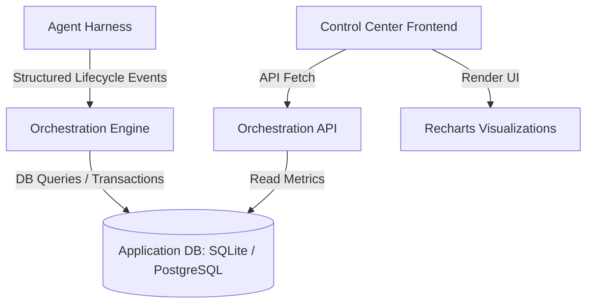

# Telemetry & Metrics Design: Agent Orchestration Control Center

This document outlines the visual, architectural, and data schema recommendations for displaying metrics at the **PRD level** and the **Issue/Run level** in the Orchestration Control Center dashboard. It incorporates specific design decisions to write metrics directly to the application database, visualize using **Recharts**, and optimize for local telemetry without external SaaS dependencies like LangSmith.

---

## 1. Architectural Telemetry Strategy (Database-Driven)

Rather than maintaining a heavy external telemetry stack or SaaS tracing systems, the telemetry pipeline writes structured execution events directly to the primary application database. 



### A. Recommended Relational Database Schema
To support high-fidelity metrics, we recommend implementing the following lightweight relational schema in the application database:

#### Table: `agent_runs`
Tracks top-level metadata and execution context for each individual Agent Run.
* `id` (UUID, Primary Key)
* `implementation_issue_id` (VARCHAR, Foreign Key to Issues)
* `status` (VARCHAR: `success`, `failure`, `running`, `pending`)
* `created_at` (TIMESTAMP)
* `completed_at` (TIMESTAMP, Nullable)
* `tokens_input` (INTEGER)
* `tokens_output` (INTEGER)
* `tokens_cached` (INTEGER)
* `total_cost` (DECIMAL)
* `lines_added` (INTEGER)
* `lines_removed` (INTEGER)
* `files_touched` (INTEGER)

#### Table: `agent_run_steps`
Tracks execution step durations and behaviors during a single run to power run-level timelines.
* `id` (UUID, Primary Key)
* `run_id` (UUID, Foreign Key to `agent_runs`)
* `step_name` (VARCHAR: `setup`, `research`, `coding`, `testing`, `integration`)
* `status` (VARCHAR: `success`, `failure`)
* `started_at` (TIMESTAMP)
* `completed_at` (TIMESTAMP)
* `error_message` (TEXT, Nullable)

#### Table: `agent_run_tests`
Tracks TDD test loop execution details.
* `id` (UUID, Primary Key)
* `run_id` (UUID, Foreign Key to `agent_runs`)
* `loop_index` (INTEGER)
* `test_command` (VARCHAR)
* `status` (VARCHAR: `passed`, `failed`)
* `duration_ms` (INTEGER)
* `code_coverage_pct` (DECIMAL, Nullable)

---

## 2. PRD-Level Metrics (The "Macro" View)

PRDs represent high-level product features owning multiple Implementation Issues. The focus at this level is on **delivery velocity, planning predictability, and aggregate resource consumption**.

### Recommended KPIs to Display

| Metric | Definition | Recharts Component |
| :--- | :--- | :--- |
| **Progress Segment** | Integrated (Done) vs. Ready, Claimed, and Failed Issues | Segmented Horizontal Track / `<BarChart>` |
| **Agent Run Success Rate** | Ratio of successful agent runs to total runs initiated | `<PieChart>` / `<ResponsiveContainer>` |
| **Cumulative Token Cost** | Total financial cost incurred across all child runs | Monospaced Text Banner |
| **Delivery Velocity** | Lead time from PRD preparation to full issue closure | `<LineChart>` (over calendar time) |

### Recommended Layout & Visualizations

#### A. Segmented Progress Bar (Recharts Stacked Bar)
Instead of a generic single-value progress bar, use a stacked `<BarChart>` with custom semantic cell coloring to visualize child issue status distribution:

* **Emerald Cell (`#10B981`)**: Integrated (Done)
* **Amber Cell (`#F59E0B`)**: Ready or Active Claim
* **Rose Cell (`#EF4444`)**: Failed Implementation Issue (Needs Review)

```tsx
import { BarChart, Bar, XAxis, YAxis, Tooltip, ResponsiveContainer } from 'recharts';

const PRDProgressBar = ({ data }) => (
  <ResponsiveContainer width="100%" height={60}>
    <BarChart layout="vertical" data={data} stackOffset="expand">
      <XAxis type="number" hide />
      <YAxis type="category" dataKey="prd_name" hide />
      <Tooltip cursor={{ fill: 'transparent' }} />
      <Bar dataKey="integrated" stackId="a" fill="#10B981" radius={[4, 0, 0, 4]} />
      <Bar dataKey="active_ready" stackId="a" fill="#F59E0B" />
      <Bar dataKey="failed" stackId="a" fill="#EF4444" radius={[0, 4, 4, 0]} />
    </BarChart>
  </ResponsiveContainer>
);
```

#### B. PRD Issue Dependency Graph
Render an interactive tree view using simple node layouts representing child issues. A custom tooltip shows the blockers for each issue, allowing operators to trace dependency bottlenecks immediately.

---

## 3. Issue / Run-Level Metrics (The "Micro" View)

Telemetry at this level is targeted at engineers and operators debugging harness behaviors, self-correction quality, and model efficiency during an individual **Agent Run**.

### Recommended KPIs to Display

| Metric | Definition | Recharts / Visual Component |
| :--- | :--- | :--- |
| **Execution Phase Timeline** | Setup vs. Search/Research vs. Coding vs. Test loop vs. Git PR | Horizontal Segmented Bar / `<BarChart>` |
| **TDD Cycle Iterations** | Step-by-step test loop progression and status | Horizontal flow diagram with status nodes |
| **Token Cost & Distribution** | Break down of input, output, and cached tokens | `<PieChart>` (Donut variant) |
| **Diff & Blast Radius** | Lines added/removed vs. files touched | High-contrast badges |

### Recommended Layout & Visualizations

#### A. Run Phase Duration Chart (Stacked Bar)
Visualize the exact time distribution of execution phases using a horizontal Recharts `<BarChart>` to identify where the agent spends the most time (e.g., getting caught in long coding/compilation loops).

```tsx
const RunTimelineChart = ({ data }) => (
  <ResponsiveContainer width="100%" height={80}>
    <BarChart layout="vertical" data={data}>
      <XAxis type="number" unit="s" />
      <YAxis type="category" dataKey="run_id" hide />
      <Tooltip />
      <Bar dataKey="setup_duration" name="Setup" fill="#64748B" />
      <Bar dataKey="research_duration" name="Research" fill="#3B82F6" />
      <Bar dataKey="coding_duration" name="Coding & TDD" fill="#8B5CF6" />
      <Bar dataKey="integration_duration" name="PR Integration" fill="#10B981" />
    </BarChart>
  </ResponsiveContainer>
);
```

#### B. Token Distribution Chart (Recharts Donut Chart)
Display how the agent utilizes the model's context window. Highlight **Cached Tokens** prominently to track cache hit performance and cost-effectiveness.

```tsx
import { PieChart, Pie, Cell, Legend } from 'recharts';

const TokenDonutChart = ({ data }) => {
  const COLORS = ['#3B82F6', '#8B5CF6', '#10B981']; // Input, Output, Cached
  return (
    <ResponsiveContainer width="100%" height={200}>
      <PieChart>
        <Pie
          data={data}
          innerRadius={60}
          outerRadius={80}
          paddingAngle={4}
          dataKey="value"
        >
          {data.map((entry, index) => (
            <Cell key={`cell-${index}`} fill={COLORS[index % COLORS.length]} />
          ))}
        </Pie>
        <Tooltip formatter={(value) => `${value.toLocaleString()} tokens`} />
        <Legend verticalAlign="bottom" height={36} />
      </PieChart>
    </ResponsiveContainer>
  );
};
```

#### C. TDD Loop Step Visualizer
Display sequential test execution loops inside the dashboard using styled React nodes:
1. **Red Step (`#EF4444`)**: Initial test failure. Hovering reveals the exact failed assertion or stack trace retrieved from the database.
2. **Auto-Correction Activity**: Small intermediate indicators representing when the harness supplied the error feedback to the LLM.
3. **Green Step (`#10B981`)**: Successful test run, resolving the iteration.

---

## 4. UI/UX Rules & Styling Tokens

To maintain visual excellence and premium feel across light and dark modes within the dashboard, apply the following design systems:

### A. Accessibility & Semantic Styling (No-Color-Only)
* **Status Contrast**: Color alone must not represent state. Pair all status backgrounds with descriptive SVGs (e.g., checkmarks for success, warning triangles for failures).
* **High Contrast Text**: Use `slate-900` on light mode and `slate-50` on dark mode. Ensure auxiliary text (such as token metrics) uses at least a `4.5:1` contrast ratio (`slate-500` / `slate-400`).

### B. Spacing & Numbers
* **Monospaced Figures**: Always format numbers (e.g., token sizes, timestamps, dollar costs, line counts) with monospaced styles (`font-mono` / `font-variant-numeric: tabular-nums`) to prevent layout shifting and jitter on live refreshes.
* **4/8px Spacing Grid**: Maintain uniform vertical and horizontal rhythm tiers (`16px`/`24px`/`32px`) across charts and metrics widgets to achieve high-end aesthetic alignment.
