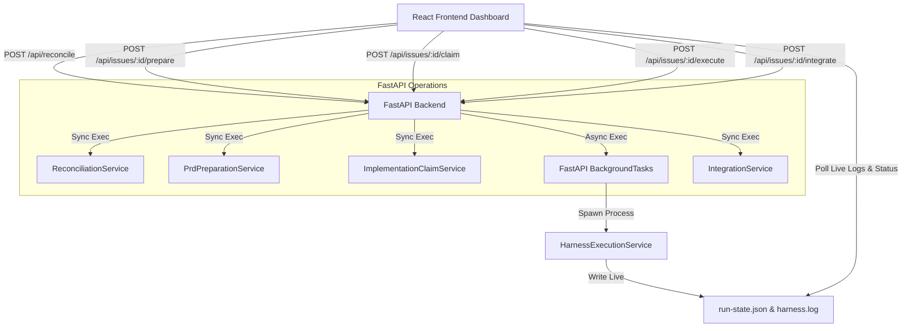

# Interactive Agent Orchestration Control Center: UX & Robustness Proposal

This document outlines a complete blueprint to transition the **Bersama Scaffold Dashboard** from a static, read-only status viewer into a **premium, interactive, and robust orchestration cockpit**. 

---

## 1. Architectural Blueprint: Interactive State Control

To make the app truly functional, we should expose the orchestrator's core commands as RESTful endpoints on the FastAPI backend and pair them with interactive triggers in the React UI.



### Proposed Backend Extensions (`src/bersama/dashboard.py`)

Here is the exact code architecture for the new POST endpoints to be added in `dashboard.py`:

```python
from pydantic import BaseModel
from fastapi import BackgroundTasks

class ClaimRequest(BaseModel):
    agent_run_id: str

# 1. State Reconciliation
@app.post("/api/reconcile")
def reconcile_issues(repo: str | None = None) -> dict[str, Any]:
    repo_cfg = get_repo_config(repo)
    active_gateway = issues_gateway or GitHubIssueGateway(cwd=repo_cfg.repo_path)
    service = ReconciliationService(issues=active_gateway)
    try:
        service.reconcile()
        return {"status": "success", "message": "States reconciled."}
    except Exception as e:
        raise HTTPException(status_code=500, detail=str(e))

# 2. PRD Preparation
@app.post("/api/issues/{issue_number}/prepare")
def prepare_prd(issue_number: int, repo: str | None = None) -> dict[str, Any]:
    repo_cfg = get_repo_config(repo)
    active_gateway = issues_gateway or GitHubIssueGateway(cwd=repo_cfg.repo_path)
    service = PrdPreparationService(issues=active_gateway, workspace=GitWorkspaceGateway())
    try:
        result = service.prepare_issue(
            repo_path=str(repo_cfg.repo_path),
            main_branch=repo_cfg.main_branch,
            issue_number=issue_number,
        )
        if not result.succeeded:
            raise HTTPException(status_code=400, detail=result.failure_message)
        return {"status": "success", "prd_branch": result.prd_branch}
    except Exception as e:
        raise HTTPException(status_code=500, detail=str(e))

# 3. Asynchronous Claim & Spawn Worktree
@app.post("/api/issues/{issue_number}/claim")
def claim_issue(issue_number: int, request: ClaimRequest, repo: str | None = None) -> dict[str, Any]:
    repo_cfg = get_repo_config(repo)
    active_gateway = issues_gateway or GitHubIssueGateway(cwd=repo_cfg.repo_path)
    service = ImplementationClaimService(issues=active_gateway, workspace=ClaimWorkspaceGateway())
    try:
        result = service.claim_issue(
            repo_path=str(repo_cfg.repo_path),
            worktree_root=str(repo_cfg.worktree_root),
            issue_number=issue_number,
            agent_run_id=request.agent_run_id,
        )
        if not result.succeeded:
            raise HTTPException(status_code=400, detail=result.failure_message)
        return {"status": "success", "implementation_branch": result.implementation_branch}
    except Exception as e:
        raise HTTPException(status_code=500, detail=str(e))

# 4. Non-blocking Asynchronous Execution (UX Masterclass)
def _run_execution_in_background(repo_name: str, issue_number: int, active_gateway: Any) -> None:
    service = HarnessExecutionService(issues=active_gateway)
    try:
        service.execute_run(repo_name=repo_name, issue_number=issue_number, config=config)
    except Exception as exc:
        print(f"Background execution failed for #{issue_number}: {exc}")
    finally:
        # Auto-reconcile state when execution completes
        try:
            ReconciliationService(issues=active_gateway).reconcile()
        except Exception:
            pass

@app.post("/api/issues/{issue_number}/execute")
def execute_issue(issue_number: int, background_tasks: BackgroundTasks, repo: str | None = None) -> dict[str, Any]:
    repo_cfg = get_repo_config(repo)
    active_gateway = issues_gateway or GitHubIssueGateway(cwd=repo_cfg.repo_path)
    # Fast-validation to prevent bad spawns
    # Check if claimed, check if worktree exists, etc.
    # ...
    background_tasks.add_task(_run_execution_in_background, repo_cfg.name, issue_number, active_gateway)
    return {"status": "started", "message": "Harness execution started in background."}
```

> [!TIP]
> **Why Asynchronous Background Execution?**
> Since running an agent harness (e.g., checking out worktrees, running tests, querying LLMs) takes minutes, performing this synchronously over HTTP causes timeouts and frozen screens. Spawning it in the background allows the dashboard to instantly return a `202 Accepted` status. The frontend's existing polling then naturally picks up the `"running"` state and displays the live log streaming in real time.

---

## 2. Visual Polish: Premium Cyberpunk & Glassmorphism Aesthetics

Applying the `ui-ux-pro-max` guidelines, we can move away from generic dark styling toward a premium developer aesthetic utilizing high-end colors, fine borders, and smooth transitions.

```
+-----------------------------------------------------------------------------------+
|  B  BERSAMA // Agent Orchestration Control Center           [RECONCILE]  [REFRESH] |
+-----------------------+-----------------------------------------------------------+
| RECENT AGENT RUNS     | PRODUCT ROADMAP & IMPLEMENTATION LIFECYCLE                |
| #12 [RUNNING]         | +-------------------------------------------------------+ |
| #8  [SUCCEEDED]       | | PRD #1: Core Dashboard Feature              [PREPARED] | |
| #5  [FAILED]          | |  L.. [SUCCEEDED] #2: API Routes       [INTEGRATED]    | |
|                       | |  L.. [READY]     #3: Claim Panel      [CLAIM ISSUE]   | |
|                       | |  L.. [BLOCKED]   #4: Execution Logic  (Blocked by #3) | |
+-----------------------+ +-------------------------------------------------------+ |
| TERMINAL CONSOLE      | | PRD #15: Multi-repo Support           [PREPARE BRANCH]| |
| 1 | npm run test      | +-------------------------------------------------------+ |
| 2 | PASS test_cli.py  |                                                           |
| 3 | [STREAMING...]    |                                                           |
+-----------------------+-----------------------------------------------------------+
```

### Visual Improvements to `index.css` & Tailwind Layout:
- **Base Background**: Smooth deep charcoal-zinc gradient (`bg-gradient-to-br from-[#09090b] via-[#0c0c0e] to-[#040405]`).
- **Glassmorphic Cards**: Ditch raw solid card styles and use fine borders with dynamic shadows:
  ```css
  .glass-card {
    background: rgba(12, 12, 14, 0.6);
    backdrop-filter: blur(12px);
    border: 1px solid rgba(255, 255, 255, 0.06);
    box-shadow: 0 4px 30px rgba(0, 0, 0, 0.4);
    transition: border-color 0.2s ease, box-shadow 0.2s ease;
  }
  .glass-card:hover {
    border-color: rgba(255, 255, 255, 0.12);
    box-shadow: 0 4px 30px rgba(0, 255, 128, 0.02);
  }
  ```
- **Monospace Font Scaling**: Use standard high-end developer fonts like `JetBrains Mono` or `Fira Code` for terminal screens and tables instead of standard browser defaults.

---

## 3. High-Fidelity UX: Features & Interactions

To give the orchestration dashboard a world-class feel, we should integrate a few key user experience upgrades.

### A. Smart Log-Streaming with Manual Scroll Lock
Currently, log auto-scrolling can feel like fighting the browser when trying to scroll up and inspect earlier failures. Adding scroll-lock detection prevents this:

```tsx
const terminalRef = useRef<HTMLDivElement>(null);
const [userScrolledUp, setUserScrolledUp] = useState(false);

const handleScroll = () => {
  if (!terminalRef.current) return;
  const { scrollTop, scrollHeight, clientHeight } = terminalRef.current;
  // If user is within 30px of the bottom, assume they want auto-scroll
  const isAtBottom = scrollHeight - scrollTop - clientHeight < 30;
  setUserScrolledUp(!isAtBottom);
};

useEffect(() => {
  if (terminalRef.current && !userScrolledUp) {
    terminalRef.current.scrollTop = terminalRef.current.scrollHeight;
  }
}, [logTail, userScrolledUp]);
```
- Add a **"Scroll to Bottom"** floating indicator if `userScrolledUp` is true, flashing green when new logs arrive.
- Add an **"Export Log"** button next to the stream switch, enabling developers to download the full `harness.log` in one click.

### B. Visual Dependency Indicators
Instead of simple crossed-out badge text (like `Blocked By: #10`), implement a **mini visual dependency tree** inside each PRD card:

```
[ Ready #8 ] ────(blocked by)────► [ Open #10 ]
```
- Render a thin SVG connecting line between blocking and blocked tasks.
- If a blocker is resolved, color the line **emerald** with a checkmark.
- If a blocker is open, pulse the line in **amber** to immediately signal to the developer why the issue cannot yet be executed.

### C. Live Action Modals & Button Micro-animations
- **Claim Issue Modal**: When clicking "Claim Issue," slide in a sleek, glassmorphism dialog asking for the `agent_run_id`. Pre-populate this field with a randomized, readable generator (e.g., `agent-run-swift-fox`) so it takes only one click to accept.
- **Button Loading Shimmer**: While executing an operation (e.g., waiting for backend branch creation), disable the button, slide in a spinner icon, and animate the text with a shimmering pulse.

---

## 4. Summary of Planned Improvements

| Feature | Current Scaffold State | Proposed Upgraded State | Target Benefit |
| :--- | :--- | :--- | :--- |
| **Actions** | CLI Only | Click-to-Trigger in Web UI | Complete ease of control |
| **Executions** | Blocked / CLI | Background Async execution | Instant screen response, 0 timeouts |
| **Log Viewer** | Rigid Auto-scroll | Smart User Scroll Lock + Export | Frustration-free inspection |
| **Visual Design**| Solid Black / Standard | Cyberpunk Glassmorphism | Premium feel and visual wow factor |
| **Dependencies** | Plain Text Badges | SVG Connecting Flows | Immediate triage of bottlenecks |

---

## 5. Recommended Next Steps

To implement these changes incrementally:
1. **Step 1 (Backend APIs)**: Add the REST POST endpoints in `src/bersama/dashboard.py`.
2. **Step 2 (Mock tests)**: Update `tests/test_dashboard.py` to cover the new endpoints.
3. **Step 3 (Frontend Actions)**: Wire up the click triggers, buttons, and state indicators in `dashboard/src/App.tsx`.
4. **Step 4 (Aesthetic Styling)**: Apply the CSS custom classes in `App.css` and `index.css` to enable glassmorphism and smooth animations.
