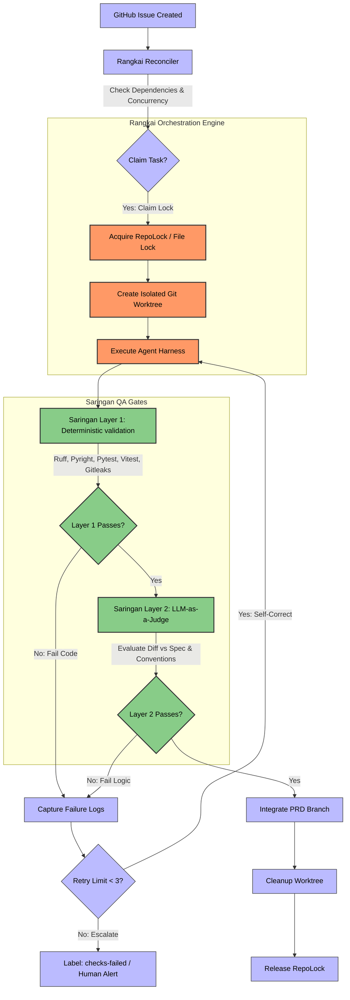

# AGENTS.md
## Agent skills

### Issue tracker

Issues live in GitHub Issues (`gh` CLI). See `docs/agents/issue-tracker.md`.

### Triage labels

Five canonical labels: `needs-triage`, `needs-info`, `ready-for-agent`, `ready-for-human`, `wontfix`. See `docs/agents/triage-labels.md`.

### Domain docs

Single-context — one `CONTEXT.md` + `docs/adr/` at the repo root. See `docs/agents/domain.md`.

### Knowledge graph (graphify)

The project has a graphify knowledge graph at `graphify-out/`. Use for codebase questions:
- `graphify query "<question>"` — BFS traversal
- `graphify path "<node>" "<node>"` — shortest path
- `graphify explain "<node>"` — explain a concept
- `graphify update .` — rebuild after code changes (no API cost)

See `.pi/agent/skills/graphify/SKILL.md` for full `/graphify` usage.


# CONTEXT.md
# Agent Orchestration

This context describes how autonomous agents select and complete GitHub issue work derived from product planning.

## Language

**PRD Issue**:
A GitHub issue that describes a planned feature or change at product-requirements level. It is identified by the `prd` label, provides context for child work, and is not executed directly by agents.
_Avoid_: Parent ticket, feature ticket, planning issue

**Prepared PRD Issue**:
A PRD Issue that has the orchestration metadata needed for child Implementation Issues to run. A PRD Issue must be prepared before its child work can be claimed.
_Avoid_: Initialized PRD, active PRD, branched PRD

**Implementation Issue**:
A GitHub issue that represents one executable unit of engineering work for an agent. It is identified by the `implementation` label, belongs to a PRD Issue, and contains enough detail for the agent to complete it independently.
_Avoid_: Ticket, sub-issue, task

**Parent PRD**:
The PRD Issue that owns an Implementation Issue. Each Implementation Issue declares exactly one Parent PRD.
_Avoid_: Parent ticket, epic, umbrella issue

**Ready Implementation Issue**:
An Implementation Issue that is eligible for autonomous execution. It has the `ready-for-agent` label and is not blocked by any open Implementation Issue.
_Avoid_: Non-blocked issue, available ticket, runnable task

**Blocking Dependency**:
An open Implementation Issue that must be completed before another Implementation Issue can be executed. Blocking Dependencies are declared in the blocked issue's `Blocked by` field.
_Avoid_: Dependency, prerequisite, blocker

**Claimed Implementation Issue**:
An Implementation Issue that has been reserved for exactly one Agent Run that is ready to start immediately. It is no longer eligible for other agents to claim while that run is active.
_Avoid_: Picked-up ticket, assigned issue, locked task

**Claim Setup**:
The transition during which a Ready Implementation Issue is being reserved for an Agent Run. It is not yet a Claimed Implementation Issue because the Agent Run is not ready to start immediately.
_Avoid_: Partial claim, half-claimed issue, pre-claim

**Active Claim**:
A Claim Setup that has successfully become a Claimed Implementation Issue. The owning Agent Run has the repository state it needs to begin execution.
_Avoid_: Final claim, confirmed claim, locked issue

**Failed Claim Setup**:
A Claim Setup that did not become an Active Claim. The Implementation Issue requires human review before another Agent Run can claim it.
_Avoid_: Broken claim, abandoned setup, failed reservation

**Stale Claim**:
A claim on an Implementation Issue whose Agent Run is no longer considered active because its claim metadata is older than the configured timeout.
_Avoid_: Dead job, abandoned task, orphaned worker

**Failed Implementation Issue**:
An Implementation Issue that an agent attempted but did not complete, including cases where its Agent Run succeeded but integration into the Parent PRD branch failed. It requires human review before it can become ready for autonomous execution again.
_Avoid_: Retriable ticket, errored task, stuck issue

**Agent Run**:
A single autonomous attempt to complete one Claimed Implementation Issue. An Agent Run either completes the issue or leaves it as a Failed Implementation Issue.
_Avoid_: Agent session, worker job, execution

**Execution Telemetry**:
Observed measurements and event history from an Agent Run, such as usage, cost, tool activity, errors, and timing. Execution Telemetry describes what happened during execution; it does not define PRD Issue, Implementation Issue, or Agent Run lifecycle state.
_Avoid_: Work state, issue state, lifecycle state

**Telemetry Diagnostic**:
An operator-facing explanation of missing, incomplete, or unreadable Execution Telemetry. A Telemetry Diagnostic does not by itself change Agent Run or Implementation Issue lifecycle state.
_Avoid_: Run failure, issue failure, lifecycle error

**Telemetry Session**:
The telemetry stream captured by an external observability system for one agent execution context. A Telemetry Session may be associated with an Agent Run, but it is not itself the Agent Run.
_Avoid_: Agent Run, issue run, worker job

**Run Telemetry Association**:
An explicit relationship between an Agent Run and the Telemetry Session data that describes that run's execution. The association must be declared by the orchestrator or harness, not inferred from timestamps, log text, or working directory alone.
_Avoid_: Telemetry guess, session match, log correlation

**Run Metrics**:
Execution Telemetry summarized for one Agent Run. Run Metrics are the primary metrics unit because each Agent Run is one distinct attempt to complete an Implementation Issue.
_Avoid_: Issue metrics, session stats

**Model Usage Metrics**:
Run Metrics that describe model token usage and provider-reported model cost for an Agent Run. Model Usage Metrics do not include shell runtime, CI usage, external API calls made by tools, or human review effort.
_Avoid_: Total run cost, tool cost, infrastructure cost

**Model Responsiveness Metrics**:
Run Metrics that describe how quickly the model starts and completes assistant output, including Time to First Token, response latency, and output tokens per second. For one Agent Run, the average value is primary and the latest value is secondary; across Implementation Issues or PRD Issues, these metrics are averaged rather than totaled.
_Avoid_: Prefill metrics, speed totals, throughput sum

**Implementation Issue Metrics**:
Execution Telemetry summarized across the Agent Runs associated with one Implementation Issue. Implementation Issue Metrics describe aggregate attempt history, not one execution attempt.
_Avoid_: Run Metrics, ticket metrics

**PRD Metrics**:
Delivery metrics summarized across the Implementation Issues and Agent Runs owned by one PRD Issue. PRD Metrics exclude planning telemetry unless that telemetry is explicitly modeled separately.
_Avoid_: Planning metrics, product metrics, feature metrics

**Run Success Rate**:
The share of Agent Runs that produced an Integrated Implementation Issue. A harness exit success without successful integration into the Parent PRD branch does not count as Run Success Rate success.
_Avoid_: Harness success rate, execution success rate

**Concurrent Agent Run**:
An Agent Run that executes at the same time as another Agent Run in the same orchestrator process.
_Avoid_: Parallel task, worker task, background job

**Agent Run Capacity**:
The number of Agent Runs that may execute at the same time. Agent Run Capacity is separate from serialized integration into a Parent PRD branch.
_Avoid_: Queue capacity, worker count, integration capacity

**Agent Harness**:
The executable adapter that performs an Agent Run for a Claimed Implementation Issue. The orchestrator selects an Agent Harness, but the harness owns the coding-agent behavior.
_Avoid_: Agent, worker, runner

**Execution Scheduler**:
The orchestration component that selects Ready Implementation Issues and starts Agent Runs within configured concurrency limits.
_Avoid_: Task queue, worker pool, job scheduler

**Scheduling Pass**:
One evaluation of Implementation Issue state that selects Ready Implementation Issues for available Agent Run capacity.
_Avoid_: Queue polling, batch, sweep

**Discovery Operation**:
A read-only orchestration operation that observes GitHub Issues, git references, worktrees, or Integration Pull Request status without changing lifecycle state.
_Avoid_: Read step, lookup, scan

**Lifecycle Mutation**:
An orchestration operation that changes issue lifecycle state, claim state, repository branches, worktrees, or Integration Pull Request state.
_Avoid_: Write step, update, side effect

**Repository Operation Lock**:
A system-wide file-based guard that prevents concurrent orchestration processes from mutating the same repository metadata at the same time.
_Avoid_: Global lock, worker lock, queue lock

**Integration Pull Request**:
A GitHub Pull Request created programmatically by the orchestrator to merge the successful commits of an Agent Run's implementation branch into its Parent PRD's PRD branch.
_Avoid_: Pull Request, PR, merge request

**Integrated Implementation Issue**:
An Implementation Issue that has had its successful Agent Run commits merged back into its Parent PRD's PRD branch via an Integration Pull Request and has been closed.
_Avoid_: Completed ticket, merged issue, done task

**Orchestration Control Center**:
The human-facing dashboard for inspecting PRD Issue and Implementation Issue state, triggering orchestration operations, and reviewing Agent Run logs.
_Avoid_: Admin panel, scaffold dashboard, cockpit


# README.md
# Rangkai: Autonomous Agentic Orchestrator (Bersama Ecosystem)

[](https://www.python.org/)
[](#1-rangkai-orchestration-engine)
[](LICENSE.md)

**Rangkai** *(pronounced: "rUNG-kye", /raŋ.kaɪ/, meaning to connect, sequence, or assemble separate parts)* is the core state-machine orchestration engine of the **Bersama** SDLC ecosystem. It coordinates autonomous agent tasks by claiming issues, spinning up isolated git worktrees, executing agent harnesses, and safely integrating code changes.

> [!NOTE]
> This repository houses the standalone **Rangkai** orchestrator and its dashboard cockpit. For details on the broader ecosystem roadmap (including the planned judge, memory, and sandbox layers), see [ECOSYSTEM.md](file:///home/ungku/programming/rangkai/ECOSYSTEM.md).

The ecosystem is built around two core architectural layers:
1.  **Rangkai (Orchestrator):** A state-machine engine that claims issues, spins up isolated worktrees, executes agent harnesses, and manages task integration (contained in this repository).
2.  **Saringan (QA & Judge Gate):** A decoupled, multi-stage quality gate combining deterministic checks with an LLM-as-a-Judge verification pipeline (designed to live in an external repository).


---

## System Architecture & Workflow

The diagram below outlines the lifecycle of an issue claim, agent implementation, validation, and integration under the Bersama ecosystem:



---

## Core Modules

### 1. Rangkai (Orchestration Engine)
*Pronounced: "rUNG-kye" (/raŋ.kaɪ/), meaning to connect, sequence, or assemble separate parts.*

Rangkai coordinates autonomous task execution using a state-graph pattern. Key engineering mechanics include:
*   **Two-Phase Transactional Claims:** Prevents race conditions by locking task ownership via GitHub metadata and repository locks before provisioning directories.
*   **Advisory File Locking (`RepoLock`):** Serializes critical Git mutations (branch forks, integrations, commits) across parallel runner processes to prevent head corruption.
*   **Process-Group Isolation:** Spawns and manages agent processes inside isolated sub-process groups, ensuring cleanup of orphan background processes if an agent fails or timeouts.
*   **Zero-Database State Reconciler:** Decouples execution state entirely into VCS (Git metadata, branches, worktrees) and GitHub Issue metadata, bypassing database synchronizations.

### 2. Saringan (Automated QA & Judge Gate)
*Pronounced: "sah-rING-an", meaning filter or sieve.*

Saringan acts as a headless code auditor that evaluates the code changes generated by active agent runs. It executes as a two-layer validation gate:
*   **Layer 1: Deterministic Gate:** Local static checks executed inside the agent's worktree. Runs Gitleaks (secrets scan), Ruff (linter), Pyright (types check), eslint, unit testing runners (pytest / vitest), pnpm build checks, and pip-audit. If any check fails, execution pauses, logs are collected, and it feeds back into the agent's retry loop.
*   **Layer 2: LLM-as-a-Judge (Decoupled):** A contextual review engine that runs after Layer 1 passes. It evaluates git diffs against the issue specification and `CONVENTIONS.md` using:
    *   **Deep Acyclic Graphs (DAG):** Decomposes code evaluation into sequential decision-tree node checks (e.g. Scope verification $\rightarrow$ Debug statements check $\rightarrow$ Acceptance checklist), failing early to conserve API tokens.
    *   **QAG-Score Checklists:** Decomposes the issue's requirements into binary "Yes/No/IDK" questions to mathematically grade implementation coverage, completely bypassing subjective scalar numeric grading (e.g. "rate code 1 to 10").
    *   **Bias Mitigation:** Strict checklist parsing eliminates cognitive LLM biases (length/verbosity biases and self-enhancement biases).

---

##  Getting Started

### Prerequisites
- `git`
- GitHub CLI `gh`, authenticated for the target repository.
- The Agent Harness command configured in `rangkai.yaml`, such as `codex`.

### Installation
Clone the repository and install in editable mode with development dependencies:

Using `uv` (recommended):
```bash
uv pip install -e ".[dev]"
```

Or using standard `pip`:
```bash
python -m pip install -e ".[dev]"
```

### Configuration
Rangkai reads `rangkai.yaml` from the current directory by default. 

```yaml
harnesses:
  codex-headless:
    command: codex
    args_template:
      - exec
      - "--dangerously-bypass-approvals-and-sandbox"
      - "$tdd solve issue #{issue_number} on github and commit once execution is complete"

repos:
  rangkai:
    repo_path: /home/me/src/rangkai
    main_branch: main
    worktree_root: /home/me/src/rangkai/worktrees
    global_concurrency: 2
    per_prd_concurrency: 1
    default_harness: codex-headless
```

### Quality Gate (Saringan Layers 1 & 2)

Each repository can configure an optional Quality Gate that runs after a successful Agent Run and before an Integration Pull Request is created. The gate invokes [Saringan](https://github.com/ungkuamer/saringan) — or any compatible validation CLI / wrapper script — as an external command and parses a machine-readable Validation Result JSON from stdout.

When configured via the unified wrapper script, the gate handles both:
1. **Saringan Layer 1 (Deterministic Validation)**: executes tests, lints, and format checks.
2. **Saringan Layer 2 (LLM-as-a-Judge)**: evaluates the implementation diff against the issue description and repo conventions.

For setup details, required environment variables, and custom model endpoints, see [Saringan Judge Gate Integration](file:///home/ungku/programming/rangkai/docs/quality-gate/saringan-judge-gate.md).

**Default behavior:** quality gates are disabled. Repos without a `quality_gate` configuration (or with `enabled: false`) skip the gate and proceed directly to Integration Pull Request creation.

#### Configuration Fields

| Field | Type | Required | Default | Description |
| :--- | :--- | :--- | :--- | :--- |
| `enabled` | boolean | no | `false` | When `false`, the gate is skipped. When `true`, `command` is required. |
| `command` | string | when enabled | — | Path to the Saringan CLI or wrapper (e.g. `saringan`, `/path/to/rangkai/scripts/saringan-quality-gate.sh`). |
| `args_template` | list of strings | no | `[]` | Positional arguments appended after `command`. Supports template variables (see below). |
| `timeout_seconds` | integer | no | `300` | Maximum wall-clock seconds for the command. Timed-out gates are treated as failures. |

#### Template Variables

The following variables are available in `args_template` strings and are rendered at invocation time:

| Variable | Value |
| :--- | :--- |
| `{repo_name}` | Repository name from config |
| `{repo_path}` | Absolute path to the repository root |
| `{worktree_root}` | Worktree root directory |
| `{worktree_path}` | Absolute path to the isolated worktree for this issue |
| `{issue_number}` | GitHub issue number of the Implementation Issue |
| `{parent_prd_number}` | GitHub issue number of the parent PRD Issue |
| `{prd_branch}` | PRD branch name (e.g. `prd/149-some-feature`) |
| `{implementation_branch}` | Implementation branch name (e.g. `impl/149/153-docs`) |

#### Example: Integrated Saringan Quality Gate Wrapper (Layers 1 & 2)

```yaml
repos:
  rangkai:
    repo_path: /home/ungku/programming/rangkai
    main_branch: main
    worktree_root: /home/ungku/programming/rangkai/worktrees
    global_concurrency: 2
    per_prd_concurrency: 1
    default_harness: codex-headless
    quality_gate:
      enabled: true
      command: /home/ungku/programming/rangkai/scripts/saringan-quality-gate.sh
      args_template:
        - "{worktree_path}"
        - "{issue_number}"
        - "{prd_branch}"
        - "{implementation_branch}"
      timeout_seconds: 900
```

#### Validation Result JSON

On success (exit code 0), Saringan must emit a JSON object on stdout containing at least a `status` key:

```json
{"status": "passed"}
```

Rangkai parses the first JSON object in stdout that contains a recognised `status` value — `passed`, `failed`, or `error` — and extracts it from surrounding text.
The `stderr` stream is treated as human-readable diagnostic output and is included in GitHub issue comments when the gate fails, truncated to the last 500 characters.

When `status` is `failed`, Rangkai includes any `checks` array and `message` string from the JSON in the diagnostic comment:

```json
{
  "status": "failed",
  "message": "Coverage dropped below 80%",
  "checks": [
    {"name": "ruff", "status": "passed"},
    {"name": "pyright", "status": "failed"},
    {"name": "pytest", "status": "failed"}
  ]
}
```

#### Gate Outcomes

| Outcome | Condition | Effect |
| :--- | :--- | :--- |
| **pass** | Exit code 0, stdout contains `{"status": "passed"}` | Integration Pull Request is created. Remote CI runs as usual. |
| **failed** | Exit code 0, stdout contains `{"status": "failed"}` or `"error"` | No PR created. `needs-triage` applied. Diagnostic comment posted. Diagnostics persisted at `<worktree>/quality-gate/`. Implementation branch and worktree preserved. |
| **invalid output** | Exit code 0 but stdout contains no valid Validation Result JSON | Same as failed. |
| **non-zero exit** | Command exits with non-zero code | Same as failed, with exit code included in diagnostics. |
| **timeout** | Command exceeds `timeout_seconds` | Same as failed. `Timed Out` noted in diagnostics. |
| **command error** | Command not found, permission denied, etc. | Same as failed. `quality_gate.error` event emitted. |

#### Relationship to Remote Integration Pull Request CI

The Quality Gate is a **local deterministic pre-flight check** that runs inside the agent's worktree before an Integration Pull Request is created. It does **not** replace remote CI/CD checks that run on the Integration Pull Request after creation.

- If the Quality Gate passes → Integration Pull Request is created → remote CI validates as normal (polled during scheduling passes).
- If the Quality Gate fails → no Integration Pull Request is ever created, so remote CI never runs.

This means a passing Quality Gate guarantees the change enters the Integration Pull Request lane, but remote CI (branch protection, required checks, statuses) remains the final arbiter before merge.

#### Diagnostics

When a quality gate blocks integration, Rangkai persists the following files to `<worktree>/quality-gate/`:

| File | Content |
| :--- | :--- |
| `stdout.txt` | Complete stdout, truncated to 100 KB |
| `stderr.txt` | Complete stderr, truncated to 100 KB |
| `result.json` | Parsed Validation Result (if valid JSON was found) |

These files are preserved alongside the implementation branch and worktree so operators can inspect what went wrong.

#### Design Notes

- Rangkai does **not** import Saringan as a Python package. The gate is always invoked as an external CLI process.
- Rangkai does **not** infer validation checks. The target repository must provide a `saringan.toml` or equivalent configuration that Saringan reads at runtime.
- Template variables are rendered with safe formatting: unknown variables are left as literal `{key}` strings rather than raising errors.

---

## Running the Dashboard

The dashboard provides a visual cockpit showing repositories, active issues, execution logs, and agent harnesses.

### Option A: Pre-built Production UI (Single Port)
Compiles React assets and serves both frontend and FastAPI endpoints on a single port (8000 by default).

1. **Build the frontend assets:**
   ```bash
   cd dashboard
   npm install
   npm run build
   cd ..
   ```
2. **Start the API server:**
   ```bash
   uv run rangkai dashboard --config rangkai.yaml --host 127.0.0.1 --port 8000
   ```
3. **Open:** [http://127.0.0.1:8000](http://127.0.0.1:8000)

### Option B: Hot-Reloading Development (Two Ports)
Runs backend API and Vite hot-reloading dev server concurrently for code modifications.

1. **Start backend API (Port 8000):**
   ```bash
   uv run rangkai dashboard --config rangkai.yaml --host 127.0.0.1 --port 8000
   ```
2. **Start Vite server (Port 5173):**
   ```bash
   cd dashboard
   npm run dev
   ```
3. **Open:** [http://localhost:5173](http://localhost:5173) (Routes requests to API on port 8000).

---

##  Observability & Telemetry

Rangkai proxies and displays Execution Telemetry (token usage, latency, and costs) using the external `pi-agent-observability` service via a zero-network telemetry pattern reading directly from SQLite files.

To run observability locally:
1.  **Navigate to observability repository:**
    ```bash
    cd /programming/pi-agent-observability/apps/observability
    ```
2.  **Start Bun server:**
    ```bash
    OBS_AUTH_TOKEN="devtoken" OBS_PORT="43190" bun server.ts
    ```
3.  **View live telemetry stream:** Open [http://127.0.0.1:43190/?token=devtoken](http://127.0.0.1:43190/?token=devtoken)

---

##  CLI Orchestrator Operations

Run one orchestration cycle:
```bash
uv run rangkai run rangkai --config rangkai.yaml
```

Run continuously until all claimable Ready Issues are complete:
```bash
uv run rangkai run rangkai --config rangkai.yaml --continuous
```

### Manual Operations (Granular Control)
*   **Reconcile issue state:** `uv run rangkai reconcile rangkai`
*   **Prepare PRD Issue branch:** `uv run rangkai prepare-prd rangkai {issue_number}`
*   **Claim an issue & build worktree:** `uv run rangkai claim-issue rangkai {issue_number} --agent-run-id {run_id}`
*   **Run harness against claimed issue:** `uv run rangkai execute-run rangkai {issue_number}`
*   **Integrate successful changes:** `uv run rangkai integrate-run rangkai {issue_number}`

---

##  License

Licensed under the Apache License, Version 2.0. See [LICENSE.md](LICENSE.md) for details.

